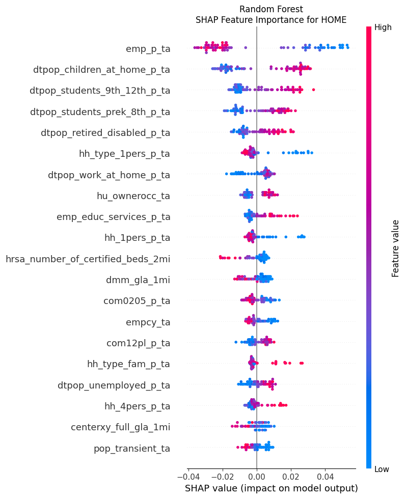
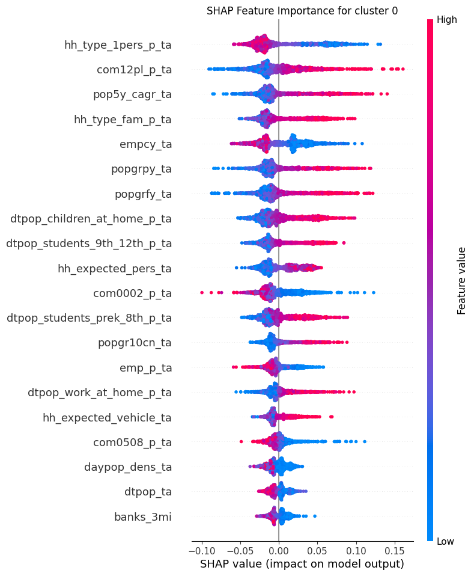
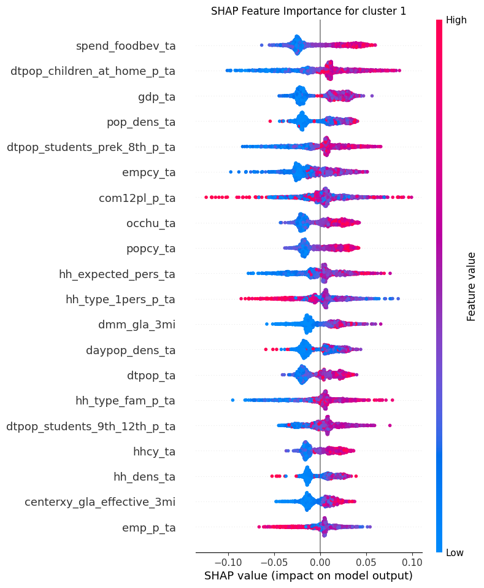
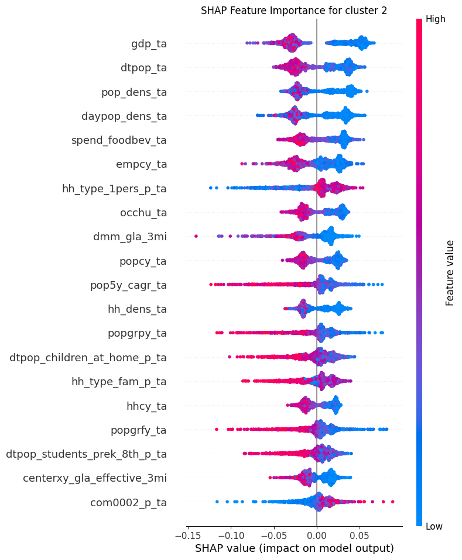
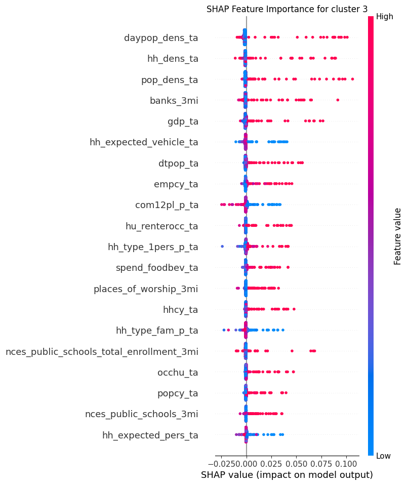
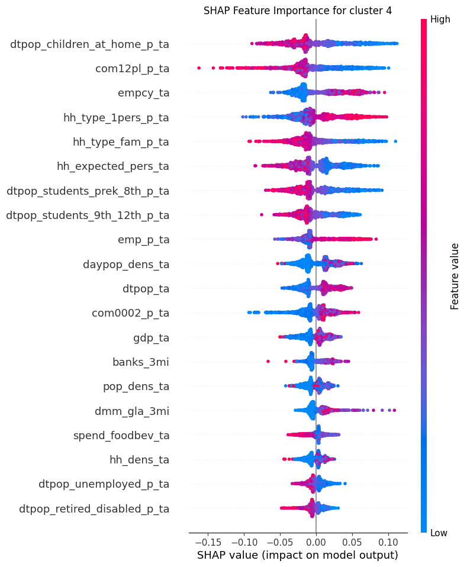

```{r setup, include=FALSE}
knitr::opts_chunk$set(echo = FALSE)
```

\newpage

## Executive Summary

The Restaurant Segmentation Analysis project aims to cluster restaurant chain locations into various categories that encapsulate the main customer demographics using features related to each restaurant location. By clustering these restaurant chain locations into different groups, chain owners can identify factors that drive business to different locations and market each location differently based on these factors. To address this problem, we need to build a supervised machine learning model for Smoothie King chain locations where the categories were already provided by Sitewise and an unsupervised machine learning model for Subway USA chain locations where we identified our own clusters.

## Introduction

Identifying the main drivers of traffic to a restaurant location is paramount to the success of the restaurant, as it allows owners to strategically market their location to cater to their main customers. The goal of this project is to cluster restaurant locations into different categories (e.g. work, home, shopping, etc.) and identify the features that cause a location to be clustered into a particular category. Within each category, we should see different combinations of features that distinguish one category from another. For instance, for the category "work", we may find important features such as a high daytime population, high percentage of office workers, etc. Sitewise and its clients can use this information to determine the main drivers of traffic and market restaurant categories differently to target specific consumers.

We received datasets for two restaurant chains: Smoothie King and Subway USA. Each dataset contains information about each store such as nearby point of interests, exact store location, and demographic information within trade areas of a store location. The Smoothie King dataset comes with the classification of each store location into one of five categories: home, shopping, travel, work, and other. The Subway USA dataset is unlabeled.

To achieve our goal, we built a separate machine learning model pipeline for each dataset.

1.  Given that the Smoothie King dataset is pre-labeled, we built a supervised machine learning model to predict the labels of each store location. We interpret the classification result by examining the most important features related to each label and identify combinations of features that lead to the prediction of a particular label.
2.  The Subway USA dataset is unlabeled, so we built an unsupervised machine learning model to cluster store locations into an acceptable number of clusters. We verify our cluster results by using Google Maps to view the store surroundings in order to manually interpret the initial label meaning. Using the labeled result by the unsupervised model, we train a supervised classification model to examine the most important features related to each label.

## Data Science Methods

### Smoothie King

The Smoothie King supervised machine learning pipeline contains the three steps:

1.  Data Preprocessing
2.  Model Building
3.  Model Interpretation

```{r out.width = '90%', fig.align='center', fig.cap = "Smoothie King pipeline"}

```

#### Data Preprocessing

&nbsp;

To preprocess the data, we performed feature selection to reduce the overall number of features that will be passed into the classification model. Under the guidance of Sitewise engineers who have domain knowledge, we removed features that contain overlapping information such as features containing "centerxy" in favor of features that contain "centerxy_full" or "centerxy_effective". They are all related to the amount of leasable land area around an area, but the features containing "full" and "effective" are more informative and encapsulate the features without those keywords. Sitewise engineers also suggested keeping features with percentage values and removing the same features that contain raw value counts. For example, between features such as the percentage of population between 0-18 years old and the actual count of people between 0-18 years old, we only kept the percentage feature because it helps us identify proportions of different demographics. Raw values are misleading in that higher values often only mean that an area is densely populated, but does not tell us the proportion of different demographics which is more useful in differentiating between label categories. We also removed features with all constant values and other features that were unnecessary such as those relating to the climate of a region, which does not provide any insight into the customer demographic.

#### Model Building

&nbsp;

We evaluate our models using the accuracy score since we want to get as many predictions correct and treat the predictions target equally. For our final model in the classification pipeline, we used a VotingClassifier that takes in three models:

-   RandomForestClassifier
-   RandomForestClassifier with L1 regularization
-   RandomForestClassifier OneVsRest with L1 regularization

This decision was reached after trying various models and tuning hyperparameters for each model. Of the models we tried (LogisticRegression, RandomForestClassifier, XGBoost, LGBMClassifier) with different methods (L1/L2 regularization, OneVsRest or multinomial classification), we got the best test score without overfitting using RandomForestClassifier. It appeared that the three RandomForestClassifier models made different predictions for certain examples, which allowed the score to increase when these models voted on the final prediction result in VotingClassifier. Furthermore, using RandomForestClassifier also has the benefit of running faster than gradient boosted tree methods such as XGBoost while still being interpretable via SHAP (Shapley Additive Explanations).

#### Model Interpretation 

&nbsp;

While ensemble models such as VotingClassifier are known to be difficult to interpret, we can interpret the model result and feature importance by examining the constituent models in VotingClassifier. By applying SHAP on the three RandomForestClassifier models, we can check for features that are important in multiple models for making a certain prediction and conclude that those must be the defining features for a target class. We do this for each target class to identify the main features for predicting those classes and verify them to ensure the features also make sense to a human.

#### Future Direction

&nbsp;

There are improvements and weaknesses in our model that we have considered. A weakness we note is that the three constituent models for VotingClassifier are all variants of RandomForestClassifiers, so while they sometimes make different predictions, most of the time they make the same predictions. It may have been better to include other models in VotingClassifier, but we found that it led to a worse overall score. An improvement that also could have been made is to perform feature engineering to combine some features such as summing all traffic data. This would have condensed multiple features together and reduced the overall number of features, making model interpretation easier. Given that we implemented the Smoothie King model first, we did not have much insight into the data, so we could not implement this improvement within the timeframe of the capstone project.

### Subway USA

The Subway USA unsupervised machine learning pipeline contains four steps:

1.  Data Preprocessing
2.  Model Building
3.  Cluster Verification
4.  Label Interpretation

```{r out.width = '90%', fig.align='center', fig.cap = "Subway pipeline"}

```

#### Data Preprocessing

&nbsp;

As the data was given by Sitewise was unlabeled, we need to build an unsupervised machine learning model to categorize the Subway USA stores into an acceptable number of clusters similar to how the Smoothie King stores were labeled (e.g. "home", "work", "shopping", etc.).

The Subway USA data shares similar features to the Smoothie King data, where they both include exact store location, point of interests nearby, and demographic information within trade areas. Based on the Smoothie King model feature importances, we keep those important features such as employment percentage and daytime retired and disabled population percentage within a trade area.

To remove the irrelevant features, we implement a similar approach as how we did for the Smoothie King model. To list a few, we use those percentage features over actual count features when they both represent the same information, remove features with constant values and features related to region climate or states of the store.

Moreover, we performed feature engineering after gaining more domain knowledge from the Smoothie King model. This includes aggregating different household sizes as an average and summing up traffic data from different directions.

#### Model Building

&nbsp;

As suggested by Sitewise, within-cluster similarities are more important than differences between clusters. We initially used K-means, DBSACN and HDBSCAN, Hierarchical clustering and Gaussian Mixture Models (GMMs), but none of them gave ideal clustering results. Not only did the cluster distribution not make sense, but also the within cluster characteristics were hard to identify on Google Maps. Instead, we found the most success with Fuzzy C-Means (FCM), giving the most distinguishable clusters with a proper distribution. Since FCM enables the cluster assignment to multiple clusters and some store locations might contain a mix of categories (e.g. "home" and "shopping"), it works well for this task. By tuning the parameters to determine how to handle points far from cluster centroids, we were able to get somewhat equally sized clusters which also had distinct characteristics between clusters. Using the training data split and performing hyperparameter tuning to minimize the within cluster distance, we obtain the best model with the smallest inertia.

#### Cluster Verification

&nbsp;

In the absence of true labels for verification, we utilized Google Maps to assess the accuracy of our clustering results. By randomly selecting 30 stores from each cluster and plotting their longitude and latitude coordinates on Google Maps, we were able to visualize their locations and surroundings. This allowed us to interpret the clusters based on the information observed, including characteristics such as residential areas, commercial zones, rural landscapes, hyper urban environments, and work-related districts.

#### Label Interpretation

&nbsp;

The label interpretation process integrated unsupervised and supervised approaches to gain insights into the unlabeled data points. Initially, using the unsupervised model (FCM), we clustered the data and assigned labels to each store. However, to further understand and interpret these labels, we employed a supervised approach. Utilizing a RandomForestClassifier and SHAP analysis, we identified the key features driving the classification within each cluster. We manually verify these features to ensure they make sense and align with our intuition. This iterative process allowed us to unravel the underlying characteristics in each cluster.

#### Future Direction

&nbsp;

There are mainly two weaknesses in the Subway USA model.

Firstly, the best tuned model uses inertia as its evaluation metric, which only focuses on within-cluster distance. For future improvement, we may need to also incorporate between clusters distance for example testing Partition Coefficient (PC), Xie--Beni Index and Fukuyama-Sugeno Index (FSI).

Secondly, we have more than 80 input features, which may not be ideal in terms of model performance and computational efficiency. Therefore, implementing additional steps for feature selection and feature engineering could significantly enhance the performance of the model. This process would not only enhance the efficiency of the model but also potentially reduce the risk of overfitting and improve its overall accuracy.

## Data Product and Results

For Smoothie King and Subway, we have a separate data processing and model training pipeline for each customer. Each pipeline is composed of several Python scripts corresponding to different stages of the pipeline, and the pipeline is automated by a Makefile to go through these stages. The data product is hosted on GitHub for the partner to access and modify in the future. The main results from both pipelines are processed data files, trained and tuned models saved in model_joblib files, and SHAP plots for each target category.

With the conda environment provided by the partner, we tailored the solution specific to their package versions to ensure a compatible product with their current development environment. The data pipelines not only provide the solutions to the corresponding two tasks here, but also can be referenced for their internal development in the future. The partner should be able to utilize the scripts from the data product and apply it to other datasets for other customers with some modification. With compatibility and flexibility as some major advantages, the data product is not as easily accessible for non-technical users, as it requires a local virtual environment for Python language with some heavy packages. Without running the pipeline locally, the results will be difficult to assess.

As instructed by the partner, visualization is not a main focus for this project. Therefore, although the pipeline generates essential images for the partner to demonstrate to the customer, it does not provide an interactive graph interface to provide additional insights into the data. During the verification process, the partner provided an internal visualization tool to see the data of store locations on the map. Ideally, we would integrate our outputs into this tool to showcase some similar store locations in each category with corresponding important features. Due to limited access to the internal tool, this task was not covered in the project. However, the partner will be able to integrate the outputs from the data product into their own visualization platform easily. In the pipeline for Subway, we implemented the map visualization for segmentation results from scratch.

\newpage

### Smoothie King model result

```{r out.width = '70%', fig.align='center', fig.cap = "Confusion matrix for test data for Smoothie King Voting Ensemble Model"}
knitr::include_graphics("../img/smoothie_king/test_cm.png")
```

The Smoothie King clustering model correctly predicts the major driving traffic type for a specific store location with around 70% accuracy for both train and test data. Given a balanced accuracy between the train and test datasets, the partner can demonstrate that the model used is stable and consistent for future data from this customer. We observe that the major error from the test set is coming from the "SHOPPING" category being predicted as the "HOME" category. This is something expected from the partner, as these two categories share a lot of similar characteristics. However, more work can be done to improve the general accuracy for the pipeline.

For the important traffic drivers for each category, the pipeline outputs a SHAP feature importance plot for each category from each model. By comparing the SHAP plots for the same category coming from the three different models included in the VotingClassifier model, if a feature appears in two or all three plots, the partner can demonstrate to the customer that the feature is an important traffic driver specific to that category. At this point, our SHAP plots still have repeated features in different categories. This will be something to work on in the future so that each category will have distinct features as the top drivers with no overlapping features across categories.

```{r out.width = '90%', fig.align='center', fig.cap = "SHAP summary plot for the RandomForestClassifier model. A lower value of emp\\_p\\_ta (employment percentage) corresponds to a higher likelihood of predicting HOME."}

```

```{r out.width = '90%', fig.align='center', fig.cap = "SHAP summary plot for RandomForestClassifier with L1 regularization. Again, a lower value of emp\\_p\\_ta (employment percentage) corresponds to a higher likelihood of predicting HOME."}

```

### Subway USA model result

The segmentation result with 5 clusters from the pipeline is verified manually by looking at similar characteristics within each cluster on Google Maps. With the supervised model trained on the results from the unsupervised model, the pipeline for Subway also outputs the feature importance for each category with SHAP plots. The feature importance for these 5 clusters generally align with human intuition and the target categories we defined, but there are also other features that did not appear before in the Smoothie King model. Therefore, more work needs to be done in the future to explore these features that may not make sense at first glance.

```{r out.width = '80%', fig.align='center', fig.cap = "SHAP summary plot for Cluster 0 which we interpret as the 'home' category. Notable features that cause the model to predict this category are low values of hh\\_type\\_1pers\\_p\\_ta (household type of 1 person), high values of hh\\_type\\_fam\\_p\\_ta (household type family), and low values of emp\\_p\\_ta (employment percentage)."}

```

```{r out.width = '80%', fig.align='center', fig.cap = "SHAP summary plot for Cluster 1 which we interpret as the 'shopping' category. Notable features that cause the model to predict this category are high values of dmm\\_gla\\_3mi (shopping centers with 200,000+ sq.ft of gross leasable area within a 3 mile radius) and high values of centerxy\\_gla\\_effective\\_3mi (gross leasable area within a 3 mile radius)."}

```

```{r out.width = '80%', fig.align='center', fig.cap = "SHAP summary plot for Cluster 2 which we interpret as the 'rural and small town' category. Notable features that cause the model to predict this category are low values of pop\\_dens\\_ta (population density) and low values of empcy\\_ta (current year employment)."}

```

```{r out.width = '80%', fig.align='center', fig.cap = "SHAP summary plot for Cluster 3 which we interpret as 'hyperurban areas' such as New York City. Notable features that cause the model to predict this category are high values of daypop\\_dens\\_ta (daytime population) and high values of pop\\_dens\\_ta (population density)."}

```

```{r out.width = '80%', fig.align='center', fig.cap = "SHAP summary plot for Cluster 4 which we interpret as the 'work' category. Notable features that cause the model to predict this category are high values of emp\\_p\\_ta (employment percentage) and low values of hh\\_type\\_fam\\_p\\_ta (household type family)."}

```

\newpage

## Conclusions and recommendations

Ultimately, a restaurant location's success is dependent on how well they can market themselves to their customers. The Restaurant Segmentation Analysis project focuses on analyzing the features that define the restaurant location's category to identify the main drivers of traffic, allowing restaurant chain owners to better market different locations to different types of customers. We were successfully able to identify some defining features for various location categories and highlighted our results using SHAP summary plots. Nonetheless, our product falls short in that not all features in the result align with human intuition. While some defining features for a category are obvious, others that are not would require further investigation along with domain knowledge to verify their importance. This project is only the first step for making astute business decisions, as our project does not take into account information relating to sales data or competition for different store locations. We recommend Sitewise to continue on this project by refining the models, such as applying further feature engineering and trying other machine learning models. The project can and should be generalized such that it can be applied to other restaurant chains that share the same features.
