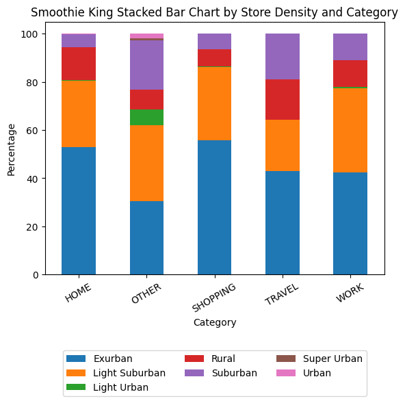

```{r setup, include=FALSE}
knitr::opts_chunk$set(echo = FALSE)
```

\newpage

## Executive Summary

The Restaurant Segmentation Analysis project, in collaboration with Sitewise Analytics, a SaaS company specializing in building a strategic real estate road map for restaurant owners, aims to identify key factors driving traffic to a specific store location and recognize patterns among similar locations. The project will serve as a preliminary step to help elevate site selection and marketing plans for the customers.

## Introduction

To plan for future expansions or market the new store strategically, restaurant franchise owners need to know the main factors that drive traffic to a location as well as the major customer group, whether it is office workers in downtown or students in a neighbourhood. This involves analyzing the surrounding population demographic, consumer behaviour in the trade area and nearby competitor/sister store information.

With each customer's marketing dynamics slightly different, the solution will be based on the data gathered around each restaurant franchise store locations. This project will take the exploratory first step in building customized solutions for three customers: Smoothie King US, Subway US and Subway Canada. At the end of the project, we expect to have the following three machine learning pipelines:

1.  A supervised machine learning pipeline using data from Smoothie King US locations to predict a store's category from one of five pre-labeled categories:

    -   Home
    -   Shopping
    -   Work
    -   Travel
    -   Other

The prediction will be human-interpretable in that the key features that determine the label (any of the categories) for a store location will be outlined for the users.

2.  An unsupervised machine learning pipeline based on data of US Subway locations that cluster locations by similar features.

3.  An unsupervised machine learning pipeline based on data of Canadian Subway locations that cluster locations by similar features.

The two unsupervised machine learning pipelines will also have human-interpretable results, including ways to identify similar features that caused different locations to be clustered together.

These machine learning data pipelines are expected to be incorporated into our partner's consulting services for these clients. The final product will be integrated into a GitHub repository, including the scripts for the machine learning data pipelines, reproducible results and reports, and documentation.

## Data Summary

The data for this project contains three datasets for each of the customers: Smoothie King, Subway Canada, and Subway US. Each dataset consists five CSV files for demographic, point of interest, store-specific data, competition sister store data, and trade area, where each row represents a single store location and the columns represent the variables/features of that store. All features in the demographic, point of interest, competition sister store, and trade area files are numeric, whereas the store-specific data files contain categorical features such as state and market size.

For Smoothie King, there are over 1000 features combined for 796 stores.

For Subway US, there are over 1000 features combined for approximately 14,000 stores.

For Subway Canada, there are around 100 features combined for around 1,800 stores.

## Understanding the Data

To help understand the data, we started with a selection of important categorical features and created some bar charts below to visually represent the distribution of these features in three datasets. The complete datasets can be accessed in the [`data`](https://github.com/mozhao0331/Restaurant_Segmentation_Analysis/tree/main/data) directory of the repository.

```{r out.width = '70%', fig.align='center', fig.cap = "Number of stores in each category for Smoothie King US locations. The distribution is unbalanced."}
knitr::include_graphics("../img/smoothie_category_bar_plot.png")
```

```{r out.width = '80%', fig.align='center', fig.cap = "The highest portion among categories are “Very Large Metro”. “Home” has a high percentage of “Very Large Metro”. “Travel” has a high percentage of “Small City”."}
knitr::include_graphics("../img/market_size_stackstacked_bar_plot.png")
```

```{r out.width = '80%', fig.align='center', fig.cap = "Most of the stores are located in “Exurban” and “Light Suburban”."}

```

```{r out.width = '70%', fig.align='center', fig.cap = "Rural has the highest count."}
knitr::include_graphics("../img/subway_us_store_density_bar_plot.png")
```

```{r out.width = '70%', fig.align='center', fig.cap = "Very Large Metro has the highest count with 5190 stores, and other categories have similar counts."}
knitr::include_graphics("../img/subway_us_market_size_bar_plot.png")
```

```{r out.width = '65%', fig.align='center', fig.cap = "The most common market size is Very Large Metro with 577 stores."}
knitr::include_graphics("../img/subway_canada_store_density_bar_plot.png")
```

```{r out.width = '65%', fig.align='center', fig.cap = "Very Large Metro has the highest count with 577 stores, and the other categories have similar counts."}
knitr::include_graphics("../img/subway_canada_market_size_bar_plot.png")
```

\newpage

## Data Science Techniques

With three distinct datasets and the challenge of building tailored solutions for each restaurant chain client, we have developed preliminary methodologies and the corresponding evaluation metrics for each dataset as followings:

1.  For Smoothie King, many features are highly correlated to one another. Therefore, it is important to start with feature selection and dimensionality reduction. Other than manually analyzing the data columns with correlation scores, we are planning to use Principal Component Analysis (PCA) to reduce the dimension and Recursive Feature Elimination to select the most important features.

    With the data and the supervised classification objective, we propose starting with a Logistic Regression model as our baseline since it is easy to interpret. We will also explore other models such as a simple Random Forest Tree regression model, as well as an LGBMClassifier as it effectively trains high-dimensional datasets and usually leads to relatively high accuracy for the multi-class problems.

    With the labeled data, the models will be evaluated by its accuracy score, with the target being 80% accuracy as outlined by Sitewise. The score would indicate if the model is capable of detecting the most important traffic driving factor to a store. The result can be interpreted with SHAP (SHapley Additive exPlanations) plots where we can visualize which features drive the decision of a particular category assignment for a certain store.

```{r out.width = '90%', fig.align='center', fig.cap = "Flow chart of Smoothie King"}
knitr::include_graphics("../img/smoothie_flow_chart.png")
```

2.  For Subway US, the main goal is to cluster the stores into different clusters where stores share similar features are in the same cluster. We propose starting with a DBSCAN model as a baseline and evaluate the clusters empirically. Afterwards, we will perform hierarchical clustering and apply PCA for dimensionality reduction and compare the results. The rationale for using hierarchical clustering is that we do not have to pre-define the number of clusters and it also allows unbalanced cluster sizes.

    Since both Smoothie King and Subway US are in the US and share similar features in their datasets, they could share similar segmentations to a certain extent. To perform PCA, the most driven features from the supervised model for Smoothie King can be used as a reference to evaluate this PCA step where more matched important features could indicate a more reasonable PCA result.

    For clustering, all possible linkage criteria will be tested to evaluate how to find similarities between clusters. Finally, since ground truth labels are not known, evaluation can be done through the Silhouette Coefficient where a Silhouette Coefficient closer to 1 suggests that a model defines well separated clusters.

    To interpret the results and empirically validate the clusters, we will randomly select a sample of stores in the same cluster and visualize them on Google Maps or Sitewise's internal application to check if they share similar geographic attributes (near highway exits, dense residential area, etc.).

\newpage

3.  For Subway Canada, we will take a similar approach to Subway US and evaluate the result.

    If the performance is not ideal, consider removing the PCA step and run clustering again to evaluate the result again with the same procedure performed on the Subway US model.

```{r out.width = '90%', fig.align='center', fig.cap = "Flow chart of Subway US and Canada"}
knitr::include_graphics("../img/subway_flow_chart.png")
```

## Timeline

```{r out.width = '90%', fig.align='center'}
knitr::include_graphics("../img/timeline.png")
```
